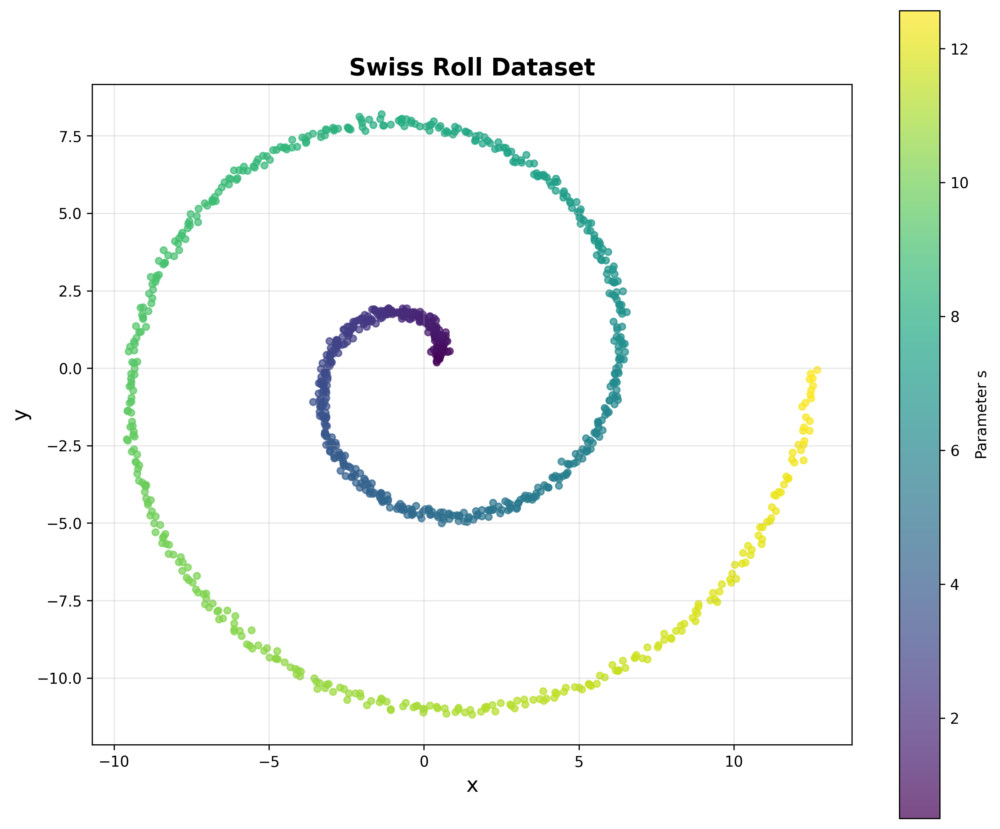
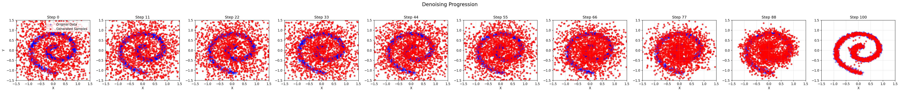
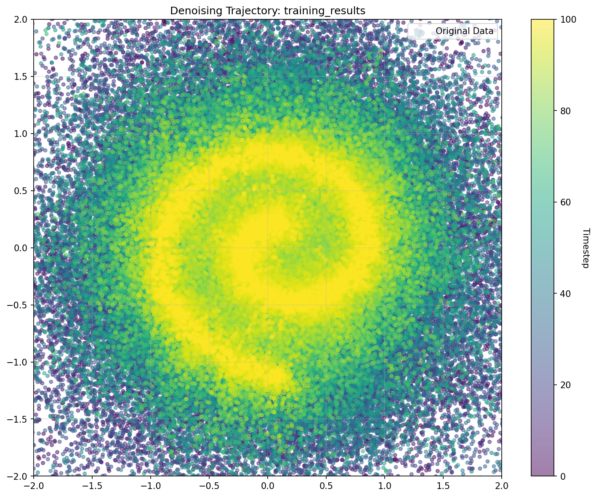

# A Simple Introduction to Diffusion Models by Example

<div class="hero-section">
  <p class="lead">A simple introduction to diffusion probabilistic models using a simple 2D Swiss Roll dataset for understanding some basic concepts before diving into more complex applications.</p>
</div>

## Table of Contents

1. [What Are Diffusion Models?](#1-what-are-diffusion-models)
   - [1.1 The Mathematical Framework](#11-the-mathematical-framework)
   - [1.2 Why This Works: The Reverse-Time SDE Connection](#12-why-this-works-the-reverse-time-sde-connection)
2. [The Swiss Roll Dataset](#2-the-swiss-roll-dataset)
   - [2.1 The Forward Process: Noise Corruption](#21-the-forward-process-noise-corruption)
   - [2.2 The Reverse Process: Learning to Denoise](#22-the-reverse-process-learning-to-denoise)
   - [2.3 Training: Learning to Predict Noise](#23-training-learning-to-predict-noise)
   - [2.4 Sampling: Generating New Data](#24-sampling-generating-new-data)
3. [Try It Yourself](#3-try-it-yourself)
4. [References](#4-references)

---

## 1. What Are Diffusion Models?

Diffusion models are a powerful class of generative models applicable across domains from images to audio to text. At their core, they model data generation as the reverse of a stochastic diffusion process that gradually transforms structured data into pure noise.

### 1.1 The Mathematical Framework

Diffusion models are inspired by non-equilibrium thermodynamics, specifically the process of diffusion where particles spread from areas of high concentration to low concentration until reaching thermal equilibrium (uniform noise). The key insight is that if we can learn to reverse this diffusion process, we can generate new samples by starting from noise and gradually "concentrating" it back into structured data.

Formally, diffusion models define two Markov processes over a sequence of latent variables $x_0, x_1, \ldots, x_T$ where:
- $x_0 \sim q_{\text{data}}(x_0)$ is the original clean data
- $x_T \sim \mathcal{N}(0, I)$ is pure Gaussian noise
- $T$ is the total number of diffusion timesteps
- $\beta_t \in (0,1)$ is the noise schedule controlling corruption rate at step $t$

1. **Forward Process**: A fixed noise corruption process that gradually destroys structure
   $$q(x_{1:T} \mid x_0) = \prod_{t=1}^T q(x_t \mid x_{t-1})$$
   $$q(x_t \mid x_{t-1}) = \mathcal{N}(x_t; \sqrt{1-\beta_t}x_{t-1}, \beta_t I)$$

2. **Reverse Process**: A learned denoising process that reconstructs data from noise
   $$p_\theta(x_{0:T}) = p(x_T) \prod_{t=1}^T p_\theta(x_{t-1} \mid x_t)$$
   $$p_\theta(x_{t-1} \mid x_t) = \mathcal{N}(x_{t-1}; \mu_\theta(x_t,t), \Sigma_\theta(x_t,t))$$

where $\theta$ represents the learnable parameters of our neural network, and $\mu_\theta, \Sigma_\theta$ are the predicted mean and covariance functions.

### 1.2 Why This Works: The Reverse-Time SDE Connection

The magic lies in a fundamental result from stochastic calculus: if you know the score function $\nabla_x \log p(x)$ (the gradient of the log-probability density), you can reverse any diffusion process. Diffusion models learn to approximate this score function through denoising, since the optimal denoising direction is proportional to the score.

## 2. The Swiss Roll Dataset

We use a 2D Swiss Roll manifold - a spiral structure parameterized as:
$$\begin{align}
x &= s \cdot \cos(s) + \epsilon_x \\
y &= s \cdot \sin(s) + \epsilon_y
\end{align}$$
where $s \in [0, 4\pi]$ and $\epsilon_x, \epsilon_y \sim \mathcal{N}(0, \sigma^2)$ add small amounts of noise. This gives us a spiral structure in $\mathbb{R}^2$ that's non-trivial but visually interpretable, with intrinsic dimension 1 (not accounting for the noise) embedded in the 2D plane.

<div class="image-container">
  
  <p class="caption">Swiss Roll dataset: A 2D spiral manifold with 1000 samples, colored by the parameter s.</p>
</div>

### 2.1 The Forward Process: Noise Corruption

Starting with clean Swiss Roll samples $x_0 \in \mathbb{R}^2$, we apply the forward diffusion process that gradually destroys the spiral structure:

1. **$t=0$**: Perfect Swiss Roll structure
2. **$t=T/4$**: Slight Gaussian perturbations, structure still visible
3. **$t=T/2$**: Significant noise, but spiral pattern remains detectable
4. **$t=3T/4$**: Heavy corruption, structure barely discernible
5. **$t=T$**: Pure Gaussian noise $\mathcal{N}(0,I)$ - all structure destroyed

The noise schedule $\beta_t$ controls this progression. For Swiss Roll, we use a linear schedule from $\beta_1=10^{-4}$ to $\beta_T=0.02$, which provides smooth interpolation while maintaining numerical stability.

Below you find a visual example of periodically sampled steps during the denoising procedure from pure Gaussian noise ($t=T$) to a good reconstruction of the swiss roll structure ($t=0$). It gives an impression of how the forward process looks like visually.

<div class="image-container">
  
  <p class="caption">Periodic steps of the denoising process, from random noise (left) to clean samples (right). Blue is ground truth, red is generated sample.</p>
</div>


### 2.2 The Reverse Process: Learning to Denoise

Our neural network $\epsilon_\theta(x_t, t)$ learns to predict the noise added at timestep $t$. Crucially, this is equivalent to learning the score function of the noisy data distribution:

$$\epsilon_\theta(x_t, t) \approx -\sigma_t \nabla_{x_t} \log p(x_t)$$

During training, the network sees:
- **Input**: Noisy Swiss Roll points $x_t$ and timestep embedding $t$
- **Target**: The actual noise $\epsilon$ that was added to get from $x_0$ to $x_t$
- **Loss**: MSE between predicted and actual noise

This training objective forces the network to learn the score function $\nabla_{x_t} \log p(x_t)$ of the noisy data distribution at each timestep $t$. The score function represents the direction of steepest ascent in log-probability space, pointing toward regions of higher data likelihood. During generation, the reverse SDE uses this learned score to perform gradient ascent on the log-likelihood, effectively reconstructing the Swiss Roll manifold structure from isotropic Gaussian noise.


### 2.3 Training: Learning to Predict Noise

```python
# Core training loop concept
for batch in dataloader:
    t = random_timesteps()           # Random timestep for each sample
    noise = torch.randn_like(batch)  # Sample noise
    noisy_data = add_noise(batch, noise, t)  # Forward diffusion

    predicted_noise = model(noisy_data, t)   # Network prediction
    loss = mse_loss(noise, predicted_noise)  # Compare with actual noise
```

### 2.4 Sampling: Generating New Data

```python
# Core sampling loop concept
def generate_samples(model, n_samples):
    x = torch.randn(n_samples, 2)    # Start from pure noise

    # Reverse diffusion: gradually denoise
    for t in reversed(range(timesteps)):
        # Predict noise at this timestep
        predicted_noise = model(x, t)

        # Remove predicted noise (with some added randomness for t > 0)
        x = denoise_step(x, predicted_noise, t)

    return x  # Clean samples that look like Swiss Roll data
```

The `denoise_step()` function implements the reverse diffusion update rule derived from the DDPM framework. Specifically, it computes:

$$x_{t-1} = \frac{1}{\sqrt{\alpha_t}} \left( x_t - \frac{\beta_t}{\sqrt{1-\bar{\alpha}_t}} \epsilon_\theta(x_t, t) \right) + \sigma_t z$$

where:
- $\alpha_t = 1 - \beta_t$ and $\bar{\alpha}_t = \prod_{s=1}^t \alpha_s$ are noise schedule parameters
- $\epsilon_\theta(x_t, t)$ is the predicted noise from our neural network
- $\sigma_t$ is the posterior variance, and $z \sim \mathcal{N}(0, I)$ for $t > 0$ (zero for $t=0$)

This update rule represents the optimal reverse transition that maximizes the likelihood of generating the target data distribution, conditioned on the learned noise prediction.

<div class="image-container">
  
  <p class="caption">The reverse diffusion process: starting from pure noise and gradually denoising to generate new Swiss Roll samples.</p>
</div>


<div class="image-container">
  
  <p class="caption">The forward diffusion process: Swiss Roll samples gradually corrupted with noise until they become indistinguishable from random Gaussian noise.</p>
</div>

## 3. Try It Yourself

```bash
# Clone and run the example
git clone https://github.com/wolrie/toy-diffusion
cd toy-diffusion
uv sync --extra=dev

# Train a model (takes ~30 seconds)
python scripts/train.py --config etc/quick_test.toml

# Check outputs/ directory for results
```

---

## 4. References

[1] Sohl-Dickstein, J., Weiss, E., Maheswaranathan, N., & Ganguli, S. (2015). Deep Unsupervised Learning using Nonequilibrium Thermodynamics. In *Proceedings of the 32nd International Conference on Machine Learning* (pp. 2256-2265).
**Links:** [PMLR](https://proceedings.mlr.press/v37/sohl-dickstein15.html) | [ArXiv](https://arxiv.org/abs/1503.03585) | [GitHub](https://github.com/Sohl-Dickstein/Diffusion-Probabilistic-Models)

[2] Ho, J., Jain, A., & Abbeel, P. (2020). Denoising diffusion probabilistic models. In *Advances in Neural Information Processing Systems* (Vol. 33, pp. 6840-6851).
**Links:** [NeurIPS](https://proceedings.neurips.cc/paper/2020/hash/4c5bcfec8584af0d967f1ab10179ca4b-Abstract.html) | [ArXiv](https://arxiv.org/abs/2006.11239) | [GitHub](https://github.com/hojonathanho/diffusion)
